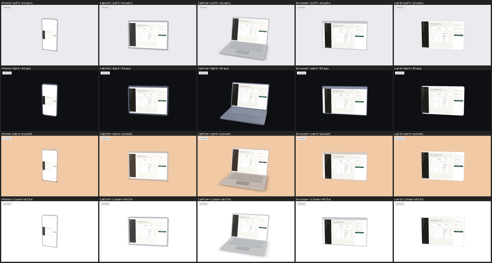

# T-P3 v2 — corrected perspective, PR #7

This is the replacement contact sheet after Novak requested corrected perspective for tablet, browser and card.
This branch stores PR attachments and is not intended to be merged.

- Implementation head: `9c011b3cd6e154209d3b496959c0a08d4c659321`.
- [PR #7](https://github.com/novakblagojevic-wq/plinth/pull/7).
- [Passing PR CI](https://github.com/novakblagojevic-wq/plinth/actions/runs/34536019583): 40 guards and 65 unit tests.
- [Passing reference PG capture](https://github.com/novakblagojevic-wq/plinth/actions/runs/34536019967): 20 captured, 20 without baselines, 0 failed.
- [All 20 original CI PNGs](https://github.com/novakblagojevic-wq/plinth/actions/runs/34536019967/artifacts/10175630474).
- Generated from those CI PNGs by unchanged `npm run pg:sheet`: 20 cells, 0 missing.
- File size: 257883 bytes.
- SHA-256: `16c239149c1c94b61c9afff0144eafdf86d071d5a45bc4155ba53e88fb555cbc`.
- All 8 phone/laptop PNGs are byte-identical to the previous PR artifact (run 34522107735). All 12 tablet/browser/card PNGs changed as requested.
- Full sheet and native-resolution tablet/browser/card images were inspected: reduced keystone distortion, upright complete demo image, retained title bar/corner mask and framing.
- No baseline blessing, independent review verdict or merge is represented here.

