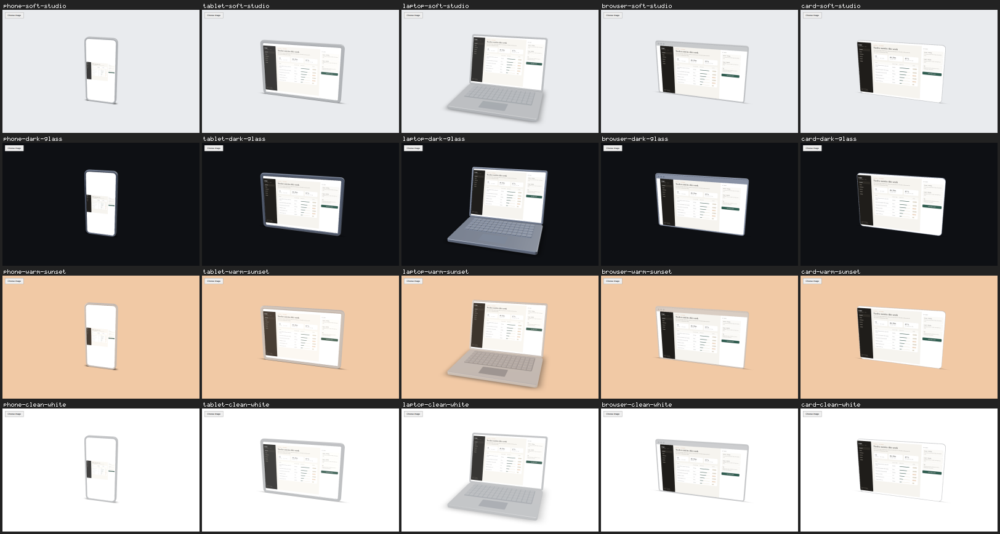

# T-P3 v2 — PR #7 contact sheet

This directory publishes visual evidence for [Plinth PR #7](https://github.com/novakblagojevic-wq/plinth/pull/7).
The evidence branch is an attachment store and is not intended to be merged.

- Tested implementation commit: `f1a2b59e48cec610ca29b020df8e9258120261aa`.
- Source: [PR pg-capture run 34522107735](https://github.com/novakblagojevic-wq/plinth/actions/runs/34522107735).
- [Original CI artifact with all 20 candidates](https://github.com/novakblagojevic-wq/plinth/actions/runs/34522107735/artifacts/10170224871).
- The unchanged `npm run pg:sheet` command tiled those CI candidates into `contact-sheet.png`: 20 cells, 0 missing.
- PNG size: 289512 bytes.
- PNG SHA-256: `80e61ceebcaff466cb5a8f916daa80cb9ef3248f11e3bc51282e55c416d7262d`.
- All 20 source PNGs were checked byte-for-byte against the downloaded CI archive before publication.
- This is evidence publication, not a baseline blessing or a review verdict. Novak's PG-3(b) decision and independent review remain outstanding.

